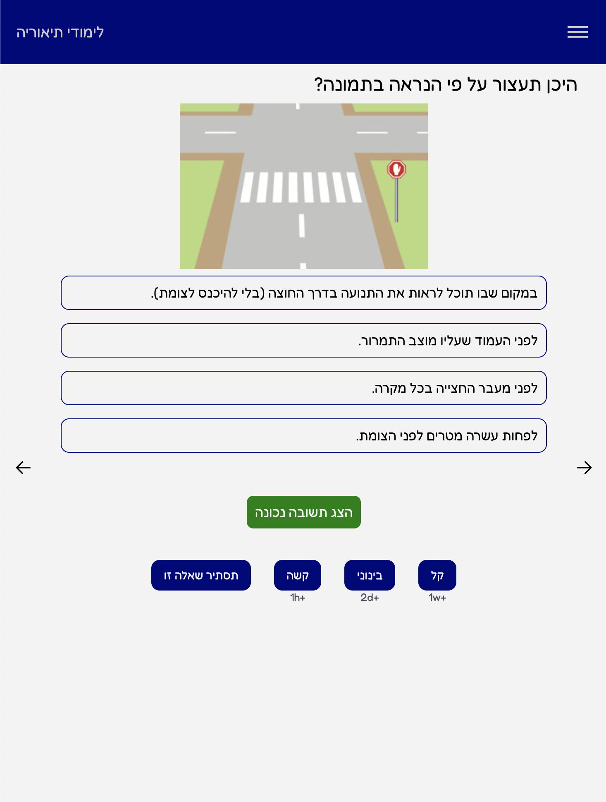

<h1 align="center">
   
   
  Smart Theory
   
</h1>

Smart and effective way of learning for the theory exam.

 

The app lets the user choose the level of the question and accordingly make the practice questions fit for the user level.

Also, the user has a pie chart that shows him the progress of the questions.
 
 
##**Technology Stack**

**build with React, Redux, Node.js, AWS EC2, AWS Route 53, AWS ALB, Firebase Authentication**

**Demo Link: Visit [Theory Study](https://theory-study.vercel.app/).**

Demo User:
 
Phone - 0523333333
 
Code - 123456

