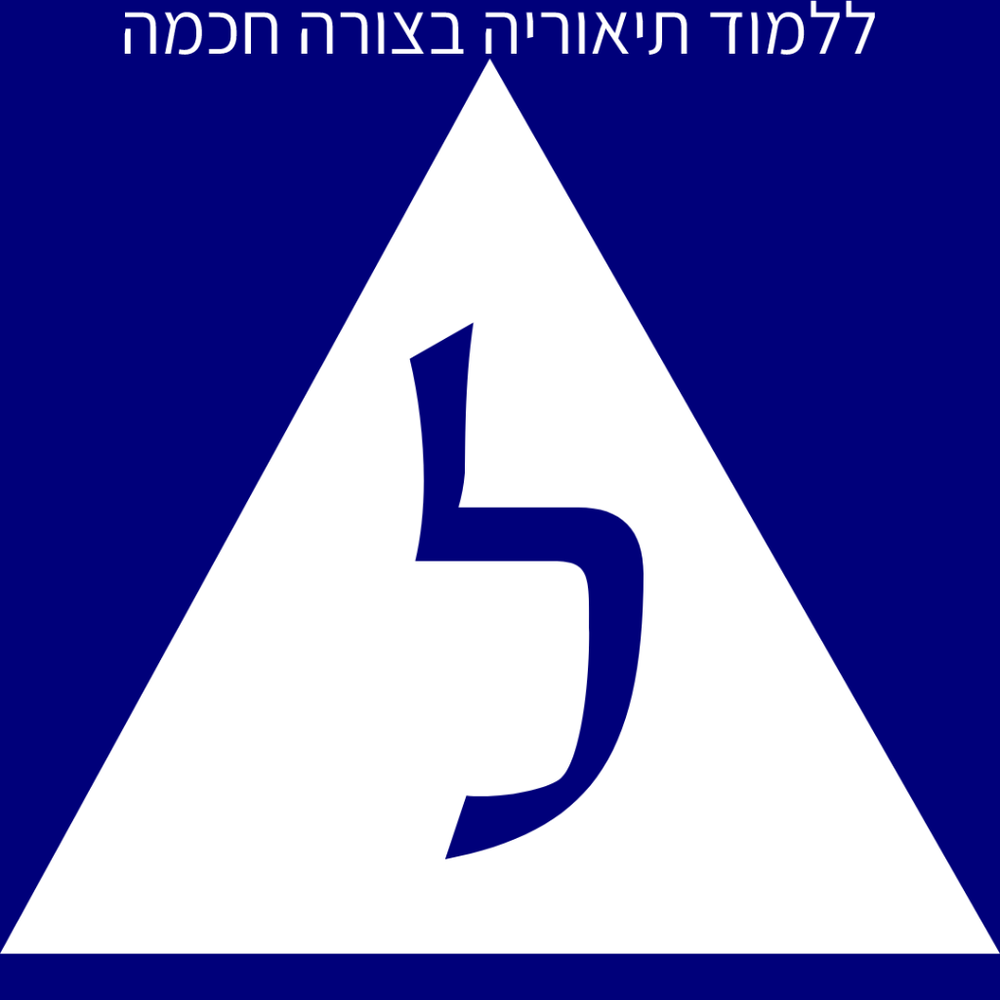
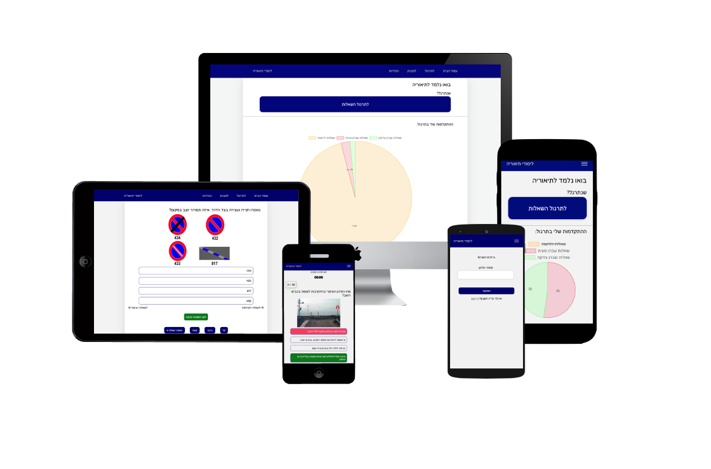

<h1 align="center">

  Smart Theory

  
   
</h1>

Smart and effective way of learning for the theory exam

 

* Answer questions based difficulty using spaced repetition, with harder questions appearing more and easy questions filtered out
* Track progress and achieve mastery - the app lets you visualize all your progress, so you can know exactly how many questions you've practiced successfully
* Exam simulator - practice for a theory exam
 
 

<h2>Demo</h2>

**Demo Link: Visit [Theory Study](https://theory-study.vercel.app/).**

### Demo User:
Phone - 0523333333
 
Code - 123456

<h2>Technology Stack</h2>

Built with:
* React (TypeScript) in NX workspace, Redux, ChartJS, Firebase Auth
* Node.js (TypeScript)
* AWS (EC2, Route 53, ALB)

